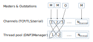

### DNP3Manager

All opendnp3 programs begin by creating a _DNP3Manager_.  Creating this object allocates a thread pool used
to process events and callbacks to user code.

```c++
// Create a root DNP3 manager with a single thread
DNP3Manager manager(1);
```

If you're familiar with using ASIO in other contexts, than it should be no surprise that the DNP3Manager owns an _asio::io_context_.
It also has a thread pool for calling _asio::io_context::run()_, but this is an internal detail that most opendnp3 programmers do
not need to know to use the stack.

How many threads you allocate to your thread pool can be a subtle matter. On simple systems like a small outstation that only
talks to a single master, one thread is sufficient. For masters that may talk to hundreds or thousands of outstations, you'll
want to scale your thread-pool to the number of logical processors on your machine.

```c++
// Create a root DNP3 manager as many threads as logical processors
DNP3Manager manager(std::hardware_concurrency());
```

**You should avoid blocking the stack during callbacks** made to user code.  This advice is especially critical for large systems where
the number of communication channels (Nc) greatly outnumbers the number of threads in the pool (Nt). If all of your threads are blocked 
then other channels can't do useful work like sending control requests to the field. If you must design your system to do some blocking,
you can mitigate this problem by scaling the number of threads in the pool as a multiple of the number of cores.

```c++
// Create a root DNP3 manager with twice as many threads as logical processors
DNP3Manager manager(2*std::hardware_concurrency());
```

Properly configuring your thread pool ensures optimal performance.

### Channels & Sessions

Communication channels are created from the root DNP3Manager class.

```c++
// Create TCP client channel to which we can bind masters or outstations
IChannel* channel = manager.AddTCPClient(...arguments...);
```

There is a unique method for adding each supported channel type, TCPClient, TCPServer, or Serial. You should refer to code documentation
for a description of the parameters.

With your channels created you can now bind master or outstations sessions to your them.  Binding multiple master or outstations sessions to a single channel
is a _multi-drop_ configuration.

```c++
// Create a master bound to a particular channel
IMaster* master = channel->AddMaster(...arguments...);

// Create an outstation bound to particular channel
IOutstation*  outstation = pChannel->AddOutstation(...arguments...);
```

### High-level view

Each channel and the sessions bound to it, are a single-threaded state-machine.  During excecution, ASIO guarantees that each channel 
is only processing one event at a time from a single thread. This means that there is no explicit thread synchronization required any where in the stack. 
When user code wants to communicate with a stack, e.g. load measurement data into an outstation or request that a command be initiated 
on a master, it gets "posted" to the correct channel's executor. This ensures that each channel and all the sessions bound to it are 
only ever touched by a single thread at a time.

User code, however, may need to worry about multi-threading. If you hand the same callback interface to multiple sessions, you will 
potentially receive callbacks from multiple threads simultaneously on the same interface.


